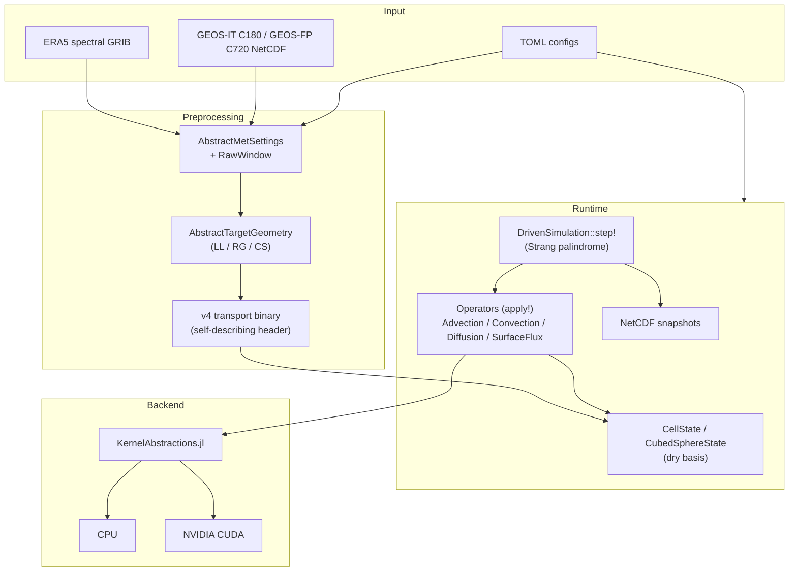

# AtmosTransport.jl

> **Work in Progress.** This project is under rapid active development. We
> regularly break things and fix them afterwards. APIs, file formats, and
> physics implementations may change without notice. If you are interested
> in contributing or following along, feel free to open an issue.

[](https://RemoteSensingTools.github.io/AtmosTransport.jl/dev/)

## Status tracker

Single source of truth for what is production-ready, what is preview /
experimental, and what is planned. Updated `2026-08-28`. Items move out
of "experimental" only after a passing CPU+GPU regression suite and a
documented validation run.

### Legend

| Symbol | Meaning |
| :---: | --- |
| ✅ | **Stable.** Used in production runs; CPU+GPU regression-tested; covered by docs. |
| 🟡 | **Preview.** Implementation complete and tested in isolation; not yet validated on a multi-day campaign. Expect rough edges. |
| 🧪 | **Experimental.** Wired in but the contract is not stable; API may move; treat output as research-only. |
| 📐 | **Planned.** Scoped in a plan / memo; not yet implemented. |
| ❌ | **Not supported.** Out of scope today; no current path to "yes". |

### Grids and topology

| Capability | Status | Notes |
| --- | :---: | --- |
| Lat-Lon (structured) | ✅ | Full operator suite, multi-tracer fused kernels |
| Reduced Gaussian (face-indexed) | ✅ | Upwind advection; spectral preprocessing + ring-aware Poisson balance |
| Cubed-sphere (gnomonic) | ✅ | Six-panel split-sweep + Lin-Rood ORD=5/7 |
| Cubed-sphere (GEOS-native) | ✅ | Panel-5 rotation, GEOS-IT C180 validated |
| Hybrid σ-pressure vertical | ✅ | TOA at k=1, surface at k=Nz |

### Met sources and preprocessing

| Capability | Status | Notes |
| --- | :---: | --- |
| ERA5 spectral → LL / RG / CS | ✅ | CDS API; `pin_global_mean_ps!` enabled |
| GEOS-IT native → CS (C180) | ✅ | Adaptive substep schedule per window |
| GEOS-FP native → CS (C720) | 🟡 | Native hourly reader and unified preprocessor ship; production validation remains limited |
| MERRA-2 native → CS | 🟡 | Wind-derived C180 preprocessor ships; unified OPeNDAP download execution remains unavailable |
| LL → CS conservative regrid | 🟡 | Works; separate regrid entry point |
| Compressed binaries at rest (zstd) | ✅ | User-side; runtime always reads uncompressed |

### Advection schemes

| Scheme | LL | RG | CS split-sweep | CS Lin-Rood | Multi-tracer fused (LL/CS) |
| --- | :---: | :---: | :---: | :---: | :---: |
| `UpwindScheme` (1st order) | ✅ | ✅ | ✅ | — | ✅ |
| `SlopesScheme` (Russell-Lerner) | ✅ | ❌ | ✅ | — | ✅ |
| `PPMScheme` (Putman-Lin) | ✅ | ❌ | ✅ | — | ✅ |
| `LinRoodPPMScheme{5}` | — | — | — | ✅ | ❌ (per-tracer loop) |
| `LinRoodPPMScheme{7}` | — | — | — | 🟡 | ❌ (per-tracer loop) |

### Diffusion (vertical)

| Kz field | Status | Notes |
| --- | :---: | --- |
| `ProfileKzField` (static) | ✅ | Constant or analytic profile |
| `DerivedKzField` (Beljaars–Viterbo) | ✅ | Default for ERA5 runs |
| `WindowPBLKzField` | ✅ | PBL-aware variant |
| `GCHPHoltslagBovilleKzField` | 🟡 | Non-local; one direct-physics test gap (shipped 2026-05-17) |
| `PreComputedKzField` (`:kz` payload) | 🟡 | Binary write/read and CS runtime path are covered by core tests |
| `DiffusiveSurfaceFluxBoundary` | 🟡 | Pre-Thomas mass add; differs from GCHP Neumann |

### Convection

| Operator | Status | Notes |
| --- | :---: | --- |
| `CMFMCConvection` (GCHP-style) | ✅ | Consumes `:cmfmc` (+ optional `:dtrain`) |
| `TM5Convection` (four-field) | ✅ | Consumes `:entu / :detu / :entd / :detd` |
| Placement: after-FV (GCHP-style) | ✅ | Default |
| Placement: in-palindrome (TM5-style) | 📐 | `[run].convection_placement` planned |

### Surface flux and chemistry

| Operator | Status | Notes |
| --- | :---: | --- |
| `SurfaceFluxOperator` + `PerTracerFluxMap` | ✅ | kg/s per cell (area-integrated) contract |
| EDGAR / GFED / GridFED / Catrine sources | ✅ | Each has a typed `AbstractSurfaceFluxSource` |
| `ExponentialDecay` (radioactive / first-order) | ✅ | Used for `222Rn → 222Pb` etc. |
| Wet deposition | ❌ | No `AbstractWetDeposition` family yet |
| Dry deposition (resistance-based) | ❌ | Today only via surface flux |
| `AtmosChemistry.jl` gas chemistry extension | 🧪 | Typed dry-basis CPU/CUDA coupling; active-species subsets, supplied J-values, bounded tiles |
| Owned photolysis calculation | ❌ | Supply J-values through typed chemistry forcing |

### Adjoint and inversion

| Capability | Status | Notes |
| --- | :---: | --- |
| Forward tape + checkpoint (revolve) | ✅ | `:device`, `:pinned_host`, `:mmap` storage |
| Surface-emission footprints (LinRood ORD=5) | ✅ | `cs_surface_emission_footprint` |
| Lin-Rood ORD=7 adjoint | 🟡 | Panel-edge VJP and checkpoint parity tests ship; campaign validation remains open |
| TM5 convection adjoint | 🟡 | Default full-column/unmerged footprint and 4D-Var gradients are finite-difference tested |
| CMFMC convection adjoint | 🟡 | Default unclamped F32/F64 transpose identity and footprint gradients are tested |
| `copy_corners` reverse | 📐 | CS halo-corner adjoint gap |
| Covariance B^{1/2} | ✅ | B1 shipped (`src/Inversion/Covariance.jl`) |
| Preconditioning + log-normal bijection | 🟡 | Linear/log-normal transforms and covariance inverse are gradient-tested |
| End-to-end CS surface-flux 4D-Var | 🟡 | Cost/gradient plus gradient-descent and L-BFGS drivers ship; campaign validation remains open |

### Backends and IO

| Capability | Status | Notes |
| --- | :---: | --- |
| CPU (multi-threaded) | ✅ | Reference path; bit-reproducible |
| NVIDIA CUDA | ✅ | End-to-end; production runs on L40S / A100 |
| Apple Silicon Metal | 🟡 | Float32 only; weakdep extension |
| AMD ROCm | 📐 | Backend axis in place; not wired |
| mmap binary reader | ✅ | Zero-copy `reinterpret` slices |
| NetCDF snapshot writer | ✅ | Typed `SingleOutputFile` / `DailyOutputFiles` |
| Replay-gate (write-time) | ✅ | Always on in preprocessing |
| Adaptive-schedule gate (load-time, opt-in) | ✅ | `[input].require_adaptive_substeps = true` |

### Documentation

| Section | Status | Notes |
| --- | :---: | --- |
| For TM5 & GCHP users | ✅ | Philosophy, binary pipeline, operators, adjoints, kernels |
| Concepts (grids, state, operators, binary) | ✅ | |
| Preprocessing reference | 🟡 | Current contract docs are being consolidated |
| Theory (mass conservation, advection) | ✅ | |
| Tutorials | 🟡 | Synthetic LL only; real-data tutorials planned |
| API reference (auto-generated) | 🟡 | Docstrings incomplete in several modules |
| Validation campaigns / inter-comparison | 📐 | Not yet a top-level page |

### Known broken

| Item | Status | Notes |
| --- | :---: | --- |
| `MERRA2Source` / `OPeNDAPProtocol` | 🔴 broken | `execute!` is a permanent `error()` stub. |


A Julia-based, GPU-portable atmospheric tracer transport model for offline
chemistry / chemical-transport applications. Designed for **mass-conserving**
advection, convection, and boundary-layer diffusion on **lat-lon, reduced
Gaussian, and cubed-sphere** grids, driven by **ERA5** or **GEOS** met data,
with a clean separation between offline preprocessing and runtime stepping.

### Column-Mean CO₂ Transport (ERA5 + EDGAR, GPU)


*One-month forward simulation (June 2024) of anthropogenic CO₂ transport on a
1° × 1° × 137-level grid, driven by ERA5 model-level spectral winds and
[EDGAR v8.0](https://edgar.jrc.ec.europa.eu/) surface emissions. The animation
shows the column-averaged mixing ratio enhancement (ppm, delta-pressure weighted)
in Robinson projection.*

**Simulation details.** Mass fluxes are pre-computed from ERA5 hybrid-level
vorticity / divergence / log-PS spectral fields following TM5's continuity-
consistent approach (Holton synthesis): horizontal mass fluxes are derived
from the spectral fields, and vertical fluxes are diagnosed from horizontal
convergence to guarantee column mass conservation. Transport uses TM5-faithful
mass-flux advection (Russell-Lerner slopes scheme with Strang splitting) and
boundary-layer diffusion (implicit Thomas solver). The entire simulation loop
— advection, diffusion, source injection, air-mass bookkeeping, and
column-mean diagnostics — runs on a single NVIDIA L40S GPU via
[KernelAbstractions.jl](https://github.com/JuliaGPU/KernelAbstractions.jl)
in Float32 arithmetic.

## Features

- **Multi-grid:** Regular lat-lon, reduced Gaussian, and cubed-sphere
  (gnomonic and GEOS-native panel conventions). Hybrid σ-pressure vertical
  coordinate.
- **Multi-source:** ERA5 spectral preprocessing (LL / RG / CS targets) and
  native cubed-sphere preprocessing for GEOS-IT C180 and GEOS-FP C720,
  plus a preview MERRA-2 wind-derived CS path. MERRA-2 data must currently
  be staged outside the unified downloader.
- **Multi-backend:** Single codebase for CPU and GPU via
  [KernelAbstractions.jl](https://github.com/JuliaGPU/KernelAbstractions.jl).
  CUDA path is end-to-end through the runtime driver; an Apple Silicon /
  Metal weakdep extension exists.
- **Mass-conserving:** Dry-basis air-mass bookkeeping, with **write-time
  replay gates** in the preprocessor (always on) and **opt-in load-time
  replay validation** at runtime. Tolerances `1e-10` (F64) / `1e-4` (F32).
- **Operator-modular:** Every physics operator is behind an abstract type
  with a `No<Operator>` no-op default; swap schemes via type dispatch
  without modifying core code.
- **Advection schemes:** `UpwindScheme` (1st order), `SlopesScheme`
  (Russell-Lerner, 2nd order in smooth regions), `PPMScheme` (Putman-Lin,
  3rd order in smooth regions), `LinRoodPPMScheme{ORD}` for cubed-sphere
  with FV3 cross-term advection (`ORD ∈ {5, 7}` selects the boundary
  stencil).
- **Convection:** `CMFMCConvection` (GCHP-style RAS / Grell-Freitas, for
  GEOS sources) and `TM5Convection` (TM5 four-field entrainment /
  detrainment, for ERA5 sources) — different physics, identical
  `ConvectionForcing` plumbing.

> **Note on adjoint maturity.** The cubed-sphere discrete-adjoint and
> surface-flux 4D-Var stack ship for the supported advection/operator matrix,
> with checkpointing, covariance preconditioning, and optimization drivers.
> Coverage is not universal: halo-corner reversal and the optimized/clamped
> convection variants remain open. See
> [Adjoint status](https://RemoteSensingTools.github.io/AtmosTransport.jl/dev/theory/adjoint_status)
> for details.

## Architecture



## Quick start

The fastest way to get a real simulation running:

```bash
# 1. Clone + install
git clone https://github.com/RemoteSensingTools/AtmosTransport.jl.git
cd AtmosTransport
julia --project=. -e 'using Pkg; Pkg.instantiate()'

# 2. Verify the install (synthetic-fixture suite, no external data)
julia --project=. -e 'using Pkg; Pkg.test()'

# 3. Download the quickstart v2 bundle (preprocessed ERA5 v3 binaries)
bash scripts/download_quickstart_data.sh ll       # newcomer path; just LL (~1.0 GB)
# or `bash scripts/download_quickstart_data.sh`   # both LL and CS bundles (~2.9 GB)

# 4. Run a 3-day advection-only simulation (GPU by default;
#    set [architecture] use_gpu = false in the TOML for CPU)
julia --project=. scripts/run_transport.jl config/runs/quickstart/ll72x37_advonly.toml
```

The bundle is hosted as assets on the
[`data-quickstart-v2` GitHub Release](https://github.com/RemoteSensingTools/AtmosTransport.jl/releases/tag/data-quickstart-v2)
and contains preprocessed transport binaries at four grid configurations
(LL 72x37, LL 144x73, CS C24, CS C90, all F32, Dec 1-3 2021). See the
[Quickstart with example data](https://RemoteSensingTools.github.io/AtmosTransport.jl/dev/getting_started/quickstart)
docs page for the full walkthrough.

By default the quickstart downloader and configs use
`~/data/AtmosTransport_quickstart`. For a different location, set the
quickstart data root before downloading and running:

```bash
export ATMOSTRANSPORT_DATA_ROOT_quickstart=/scratch/$USER/AtmosTransport_quickstart
bash scripts/download_quickstart_data.sh ll
```

Production configs use `$ATMOSTRANSPORT_DATA_ROOT/...`, which defaults to
`~/data/AtmosTransport` when unset.

Quickstart configs default to `use_gpu = true` with automatic backend
detection: CUDA on NVIDIA hosts and Metal on Apple Silicon. If no usable GPU
backend is available, the run fails rather than falling back to CPU; set
`[architecture] use_gpu = false` in the TOML for CPU execution.

## Documentation

Full documentation lives at
[RemoteSensingTools.github.io/AtmosTransport.jl](https://RemoteSensingTools.github.io/AtmosTransport.jl/dev/).
The reading order:

1. **[Getting Started](https://RemoteSensingTools.github.io/AtmosTransport.jl/dev/getting_started/installation)** — install, quickstart, first run, inspecting output.
2. **[Concepts](https://RemoteSensingTools.github.io/AtmosTransport.jl/dev/concepts/grids)** — grids, state & basis, operators, binary format.
3. **[Tutorials](https://RemoteSensingTools.github.io/AtmosTransport.jl/dev/tutorials/_generated/synthetic_latlon)** — Literate-driven, runnable end-to-end examples.
4. **[Preprocessing](https://RemoteSensingTools.github.io/AtmosTransport.jl/dev/preprocessing/overview)** — ERA5 spectral, GEOS native CS, regridding, conventions cheat sheet.
5. **[Theory & Verification](https://RemoteSensingTools.github.io/AtmosTransport.jl/dev/theory/mass_conservation)** — mass-conservation derivation, advection schemes, conservation budgets, validation status, adjoint status.
6. **[Configuration & Runtime](https://RemoteSensingTools.github.io/AtmosTransport.jl/dev/config/toml_schema)** — TOML schema, output schema, data sources.
7. **[API Reference](https://RemoteSensingTools.github.io/AtmosTransport.jl/dev/api/)** — auto-generated per submodule.

A high-signal in-repo summary of invariants and "fast failure triage" lives in
this README and the reference docs under [`docs/reference/`](docs/reference/).

## Design principles

- **Julian:** Multiple dispatch, parametric types, no OOP inheritance chains.
- **TM5-faithful where it matters:** Russell-Lerner slopes (`SlopesScheme`)
  and TM5 four-field convection (`TM5Convection`) implement the same
  numerics as the corresponding TM5 routines (`advectx__slopes` /
  `advecty__slopes` for slopes; `entu / detu / entd / detd` for
  convection), verified by parity tests in `test/test_tm5_*.jl`.
- **GCHP-style for GEOS sources:** CMFMC convection
  (`CMFMCConvection`) for the GEOS native CS path matches GCHP's RAS /
  Grell-Freitas physics.
- **Grid-agnostic operators:** Physics code dispatches on grid type via
  multiple dispatch; never assumes lat-lon layout.
- **Extension-friendly:** Abstract types + interface contracts; adding a
  new scheme never requires editing core code.

## Validation

- **Verification (synthetic-fixture suite):** the core test tier runs on
  every push and PR — uniform-tracer invariance, mass-budget conservation,
  cross-window replay closure, and conservative-regrid mass closure.
  GPU agreement checks run when CUDA hardware is available; ordinary hosted
  CI is CPU-only. The dedicated A100 regression is documented in `test/README.md`.
- **Cross-day continuity (real GEOS-IT data):** preprocessor closes
  write-time replay gate at machine epsilon (`5.94e-16` F64,
  `~3.5e-7` F32 measured).
- **Multi-month + observational closure:** *not yet done*; the forward
  operators have the fidelity, the cross-model intercomparison reports
  haven't been written yet. See
  [Validation status](https://RemoteSensingTools.github.io/AtmosTransport.jl/dev/theory/validation_status)
  for the honest current-state report.

## References

- Krol et al. (2005): TM5 two-way nested zoom algorithm.
- Huijnen et al. (2010): TM5 tropospheric chemistry v3.0.
- Russell & Lerner (1981): Slopes advection scheme.
- Putman & Lin (2007): Finite-volume on cubed-sphere grids.
- Tiedtke (1989): Mass flux scheme for cumulus parameterization.
- Colella & Woodward (1984): Piecewise Parabolic Method (PPM).

## License

MIT.
