# [Operators](@id Operator-concepts)

Every physics process in AtmosTransport is implemented behind an
**abstract operator type** with a `No<Operator>` no-op default. The
runtime composes operators through a fixed Strang palindrome; users
swap implementations by changing one field in the TOML config (or by
implementing a new subtype and registering it).

## The five operator families

```mermaid
classDiagram
    class AbstractOperator
    class AbstractAdvectionScheme
    class AbstractDiffusion
    class AbstractConvection
    class AbstractSurfaceFluxOperator
    class AbstractChemistryOperator
    class UpwindScheme
    class SlopesScheme
    class PPMScheme
    class LinRoodPPMScheme
    class NoDiffusion
    class ImplicitVerticalDiffusion
    class NoConvection
    class CMFMCConvection
    class TM5Convection
    class NoSurfaceFlux
    class SurfaceFluxOperator
    class NoChemistry
    class ExponentialDecay
    class CompositeChemistry

    AbstractOperator <|-- AbstractAdvectionScheme
    AbstractOperator <|-- AbstractDiffusion
    AbstractOperator <|-- AbstractConvection
    AbstractOperator <|-- AbstractSurfaceFluxOperator
    AbstractOperator <|-- AbstractChemistryOperator
    AbstractAdvectionScheme <|-- UpwindScheme
    AbstractAdvectionScheme <|-- SlopesScheme
    AbstractAdvectionScheme <|-- PPMScheme
    AbstractAdvectionScheme <|-- LinRoodPPMScheme
    AbstractDiffusion <|-- NoDiffusion
    AbstractDiffusion <|-- ImplicitVerticalDiffusion
    AbstractConvection <|-- NoConvection
    AbstractConvection <|-- CMFMCConvection
    AbstractConvection <|-- TM5Convection
    AbstractSurfaceFluxOperator <|-- NoSurfaceFlux
    AbstractSurfaceFluxOperator <|-- SurfaceFluxOperator
    AbstractChemistryOperator <|-- NoChemistry
    AbstractChemistryOperator <|-- ExponentialDecay
    AbstractChemistryOperator <|-- CompositeChemistry
```



## The `apply!` contract

Each operator family's mutating entry point has a uniform shape, with
the second positional argument carrying whatever time-resolved data
that family needs:

| Family | Signature |
|---|---|
| Advection | `apply!(state, fluxes, grid, scheme, dt; workspace, cfl_limit, diffusion_op, emissions_op, meteo)` |
| Diffusion | `apply!(state, meteo, grid, op::AbstractDiffusion, dt; workspace)` |
| Convection | `apply!(state, forcing::ConvectionForcing, grid, op::AbstractConvection, dt; workspace)` |
| Surface flux | `apply!(state, meteo, grid, op::AbstractSurfaceFluxOperator, dt; workspace = nothing)` |
| Chemistry | `apply!(state, meteo, grid, op::AbstractChemistryOperator, dt; workspace = nothing)` |

Every method mutates `state` in place. Performance-sensitive implementations
keep reusable scratch buffers in workspaces. Each family provides an identity
operator (`NoAdvection`, `NoDiffusion`, `NoConvection`, `NoSurfaceFlux`, or
`NoChemistry`) so the runtime can compose one typed model without conditionally
calling absent physics.

Topology dispatch happens **inside** each `apply!` method, not on a
separate axis: an LL state and a CS state route through different
specialized kernels via Julia's multiple dispatch on the grid type.

## Advection

`AbstractAdvectionScheme` is the root; the concrete schemes live in
`src/Operators/Advection/schemes.jl`:

| Subtype | Smooth-region reconstruction | Notes |
| --- | --- | --- |
| `UpwindScheme` | First order | Donor-cell; cheap, very diffusive. |
| `SlopesScheme{L}` | Second order | Russell-Lerner slopes (TM5 `sl_advection` port). Limiter parameter `L`. |
| `PPMScheme{L,V}` | Second order | Limited piecewise-parabolic edges set a Russell–Lerner slope. Limiter parameter `L`. `V = FV3ScalarProfile` (CS only) integrates FV3's `kord = 8` parabola in the vertical sweep. Supported on LL and CS split-sweep; RG supports upwind only. |
| `LinRoodPPMScheme` | Piecewise parabolic | FV3 horizontal cross terms (CS only), paired with vertical upwind. `ppm_order=5` or `7` selects the edge-value family; both share the same interior reconstruction. |

Reconstruction order does not establish the temporal order or positivity of
the complete transport update. See [Advection schemes](@ref) for the boundary
treatment and [Validation status](@ref) for measured scheme coverage.

Limiter parameter `L` ranges over `NoLimiter`, `MonotoneLimiter`,
`PositivityLimiter` — declared in the same file. `PPMScheme()` defaults
to `MonotoneLimiter()`. The default limiter is signed and constant-offset
equivariant; only `PositivityLimiter` uses tracer zero as a bound.

**TOML config** (preferred form):

```toml
[advection]
scheme = "slopes"     # "upwind" | "slopes" | "ppm" | "linrood"

# Cubed-sphere only: pick the Lin–Rood edge-value family (5 or 7).
# Only valid with scheme = "linrood"; setting ppm_order with
# scheme = "ppm" errors at config-parse time.
# scheme    = "linrood"
# ppm_order = 7
```

A `NoAdvection` identity operator is available for isolating other
operators (e.g. convection-only timing, regression). Select with
`[advection] scheme = "none"`. Diffusion-only runs are supported as a
single mass-conserving vertical solve. Surface fluxes require an advection
palindrome and are therefore rejected with `NoAdvection`.

## Diffusion

`AbstractDiffusion` is the root; concrete subtypes:

| Subtype | Use |
|---|---|
| `NoDiffusion()` | Identity no-op; default when `[diffusion]` is absent or `kind = "none"`. |
| `ImplicitVerticalDiffusion{FT, KzF, SFC}` | Backward-Euler vertical diffusion driven by an `AbstractTimeVaryingField` Kz. `SFC` chooses midpoint source splitting or source-before-full-solve ordering. |

Generic Kz diffusion uses a per-column backward-Euler tridiagonal solve with
a supported transpose in the CS adjoint. The exact TM5 Dkg path instead uses
column-conservative bidiagonal factors directly on tracer storage, preserving
weak transfers and signed mass budgets. Its reverse applies the factor
transposes in reverse order. See [Adjoint status](@ref) for supported combinations.

**TOML config** (`[diffusion]` block):

```toml
[diffusion]
kind  = "constant"
value = 1.0      # Kz [m²/s]; broadcast to all (i, j, k)
```

`kind = "none"` (or omitting the block entirely) selects `NoDiffusion`.
Cubed-sphere binaries carrying PBL surface sections can use
`kind = "tm5_beljaars_viterbo_local_kz"`.
On lat-lon and cubed-sphere grids, `surface_flux_boundary = true` adds
configured surface mass before one full implicit vertical solve
(`S(dt) -> V(dt)`) instead of using the separate
midpoint split (`V(dt/2) -> S(dt) -> V(dt/2)`). The key name is historical:
this changes operator ordering, not the lower row of the tridiagonal system.
Reduced-Gaussian transport currently supports midpoint splitting only and
rejects `surface_flux_boundary = true` while building the runtime recipe.
Profile / derived / precomputed Kz fields exist in `src/State/Fields/` — see
[State & basis](@ref) for the full field-type list.

## Convection

`AbstractConvection` is the root; concrete subtypes:

| Subtype | Forcing carrier | Source |
| --- | --- | --- |
| `NoConvection()` | — | Identity no-op; default. |
| `CMFMCConvection()` | `ConvectionForcing.{cmfmc, dtrain}` | GCHP-style upwind moist convection; mass flux + optional detrainment. |
| `CMFMCMatrixConvection()` | `ConvectionForcing.{cmfmc, dtrain}` | Implicit matrix solve assembled from GEOS cloud-mass flux and detrainment. |
| `TM5Convection{FT}()` | `ConvectionForcing.tm5_fields.{entu, detu, entd, detd}` | TM5 Tiedtke-1989 four-field entrainment / detrainment with an implicit column solve. Parametric on `FT`. |

The convection subtypes consume a `ConvectionForcing` carrier (declared in
`src/MetDrivers/ConvectionForcing.jl`) — different physics, identical
plumbing. `_refresh_forcing!` populates `model.convection_forcing`
each substep by copying from the current met window; the operator
does not call `current_time` itself.

**TOML config** (`[convection]` block):

```toml
[convection]
kind = "cmfmc"     # or "cmfmc_matrix" / "tm5" / "none"
```

The runtime picks `:cmfmc` only against binaries whose header carries
the `:cmfmc` payload section (and `:dtrain` if requested); similarly
for `:tm5` requiring `:entu / :detu / :entd / :detd`. Asking for a
convection scheme the binary does not support is a **load-time
error**, not a silent fallback.

## Surface flux (sources)

`AbstractSurfaceFluxOperator` is the root; concrete subtypes:

| Subtype | Use |
|---|---|
| `NoSurfaceFlux()` | Identity no-op; default. |
| `SurfaceFluxOperator{M}` | Applies a `PerTracerFluxMap` of `SurfaceFluxSource`s to the bottom-most layer (`k = Nz`). |

`SurfaceFluxOperator` is materialized from
`[tracers.<name>.surface_flux]` blocks and is the path for emissions
inventories (EDGAR, GFED, GridFED, LMDz, …). See the worked CATRINE configs
(`config/runs/catrine_*.toml`) for examples.

## Chemistry

`AbstractChemistryOperator` is the root; concrete subtypes:

| Subtype | Use |
|---|---|
| `NoChemistry()` | Identity no-op; default. |
| `ExponentialDecay` | Applies configured first-order loss rates to selected tracers. |
| `CompositeChemistry` | Applies a typed tuple of chemistry operators in sequence. |

Chemistry runs after the transport and convection blocks. The same operator
interface covers `CellState` and `CubedSphereState`; topology dispatch selects
the storage-specific kernel launch.

## Transport composition

The directional advection shell is a palindrome. Its center follows the
diffusion operator's surface-coupling policy:

```text
forward:   X → Y → Z   (each direction CFL-subcycled)
center A:  V(dt/2) → S(dt) → V(dt/2)   (default symmetric Strang split)
center B:  S(dt) → V(dt)               (LL/CS source-before-full-solve policy)
           [without surface flux, the center is one V(dt); NoDiffusion is a no-op]
reverse:   Z → Y → X   (same subcycle counts)
post:      apply!(convection)   (convection is outside the palindrome)
           apply!(chemistry)    (chemistry is outside the palindrome)
```

`V` is `apply_vertical_diffusion_vmr!` and `S` is `apply_surface_flux!`.
Center A is time-symmetric and lets fresh bottom-layer storage diffuse in both
half solves. Center B reproduces the supported GCHP-style placement of fresh
surface storage before one full solve; it is an ordering policy, not a
time-symmetric Strang center or a different tridiagonal boundary condition.
Reduced-Gaussian transport implements Center A only.

Convection and chemistry sit **outside** the palindrome for the same
reason: they are not commutative with advection at the per-substep
level, and their natural cadence is the met window rather than the
advection sub-step.

## Adding a new operator

The same recipe applies in every family:

1. Subtype the abstract root: `struct MyConvection <: AbstractConvection; … end`.
2. Provide a `No<Operator>` peer if one doesn't already cover your slot — usually it does.
3. Implement `apply!(state, …, op::MyConvection, dt; workspace)` for whichever grid types you support. Multiple dispatch on the grid type handles topology specialization.
4. Wire selection from TOML through `RuntimePhysicsSpecs.jl` and its topology-dispatched `materialize` methods.
5. Test that the `No<Operator>` path is bit-exact to the explicit no-op — this is the contract that lets future code skip the slot for free.

## What's next

- [Binary format](@ref) — what the operator's input data looks like
  on disk, and how the runtime validates it.
